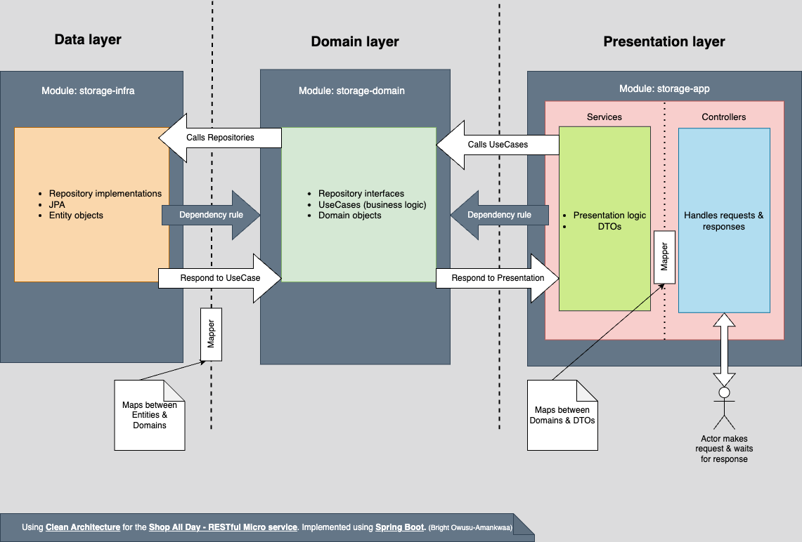
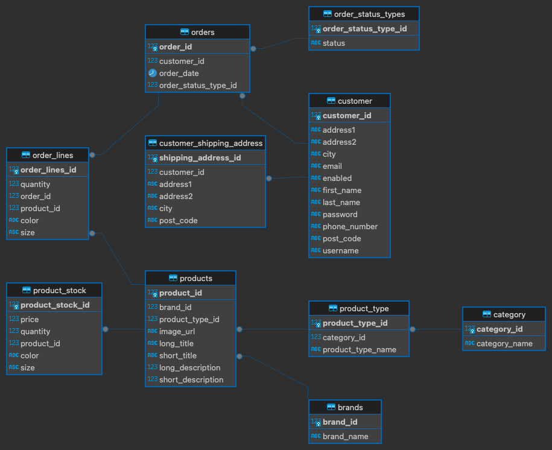

# Shop All Day - Spring Boot Web Service Demo

## Purpose
The purpose of this demo <b>Spring Boot</b> RESTful microservice is to handle all client-related requests via various CRUD (Create, Read, Update & Delete) operations through its various endpoints. These endpoints include:

- Customer
- Products
- Brands
- Categories
- Orders
- and more.

This will allow the client to view all the information related to the e-commerce [Shop All Day Project](http://ec2-13-40-6-197.eu-west-2.compute.amazonaws.com/) backend data and build a front-end client the user can interact with.

### See Endpoints on Swagger
[Interact with endpoints here](http://ec2-13-40-6-197.eu-west-2.compute.amazonaws.com:8080/swagger-ui/index.html)

## Application Architecture
I've chosen to implement this using Clean Architecture by breaking the app into three main modules.

### storage-app
- Responsible for the presentation of data and handling client requests & responses via its controllers.
- Calls its service classes and then calls on the business rules defined in the use cases by calling the storage-domain module.
- Decides which service methods have which transaction strategy.
- **Dependency rule**: Points inwards to the storage-domain.

### storage-domain
- Responsible for handling all business rules for the application via its UseCases.
- Domain objects are kept here.
- Repository interfaces are defined here.
- Responsible for calling the repository.
- **Dependency rule**: Has no dependencies. This is a pure Java module, without any knowledge of the Spring framework or any other module in the application.

### storage-infra
- Responsible for all data persistence.
- Implements the repository interfaces defined in our domain module.
- Uses a JPA abstraction above Hibernate & a PostgreSQL database.
- Responsible for performing the actual CRUD operations via Entities etc. to persist.
- Maps entity objects back to domain objects and responds back to the caller, the use case.
- **Dependency rule**: Points inwards to the storage-domain.

## Why Clean Architecture and Not Just the Traditional Approach?

### Traditional Approach
- **Controllers**: Handle client requests/responses.
- **Services**: Handle business logic.
- **Infrastructure (data layer)**: Handles persistence.

Clean Architecture is a proven application architecture that applies to all applications, aiming to achieve a separation of concerns. While the traditional approach does separate concerns, it does not separate them as much as using a domain layer between the service & data layers.

### Here's Why

#### Testability
Clean Architecture promotes writing testable code. Since business logic is isolated in the domain layer, it can be tested independently of external systems like databases and web servers. This modularity ensures that unit tests can be written for each layer, improving test coverage and reliability.

#### Prevent Service Class from Knowing Too Much Implementation Detail
JPA tends to have a big influence on the Service class. When a repository has been injected into a service, all the JPA methods such as `findById`, `findAll`, `findByThis`, or `findByThat` suggest you are using JPA. In reality, this should be abstracted away from the acting client (in this case, the Service class). If we decide not to use JPA (for whatever reason), the interface injected into the Service class becomes redundant. By using our own interfaces and isolating business logic from infrastructure and presentation concerns, Clean Architecture makes it easier to maintain and scale the application. Changes in one layer (e.g., switching from a relational database to a NoSQL database) can be made with minimal impact on other layers. Injecting the repository directly into the service pollutes the service with too many JPA-fied methods and behavior.

#### Reusability
The separation of concerns allows for the reusability of business logic across different types of applications (e.g., web, desktop, mobile). Since the domain layer is free from any framework-specific code, it can be reused in different contexts.

#### Flexibility and Adaptability
With Clean Architecture, you can easily swap out components without affecting the rest of the system. For instance, if you decide to change the web framework from Spring MVC to another framework, only the presentation layer (storage-app) would be affected. The business logic and data access layers remain untouched.

### Data Flow
A client makes a request, which is picked up by a controller, then forwarded to a service, then to a use case, then to a repository, and then returned back up the chain to the client.

### Dependency Rule
Dependencies point inwards to the storage-domain.

### Application Architectural Diagram

### Database Entity Relationship Diagram
